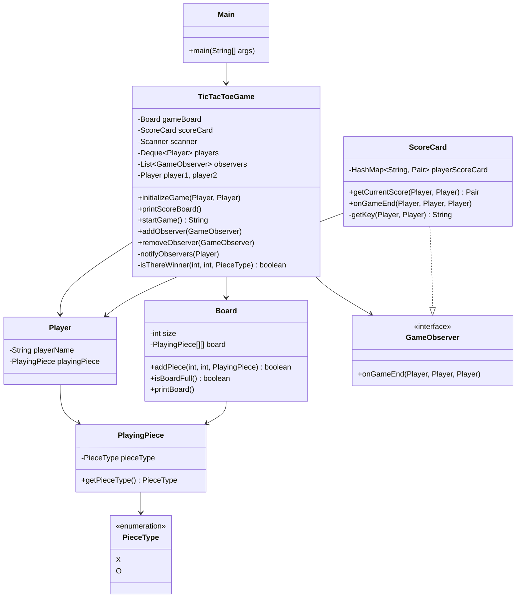

# TicTacToe

A console-based TicTacToe game implemented in Java with score tracking and proper logging.

## Requirements
- Java 21
- Maven

## Dependencies
- Lombok - Code generation
- JavaFX Base - Pair utility
- SLF4J Simple - Logging

## How to Run
```bash
mvn compile exec:java -Dexec.mainClass="org.deepak.Main"
```

## Features
- Console-based gameplay
- Score tracking across multiple games
- Input validation with error handling
- Win detection (rows, columns, diagonals)
- Structured logging with SLF4J
- Observer pattern for automatic score updates
- Normalized player matchups (A vs B = B vs A)

## How to Play
- Two players take turns (Player1: X, Player2: O)
- Enter row,column coordinates (0-2) when prompted
- First player to get 3 in a row wins
- Scores are tracked and displayed

## File Structure
```
src/main/java/org/deepak/
├── Main.java                 # Entry point with logging
├── TicTacToeGame.java        # Game logic controller with Observer pattern
└── dto/
    ├── Board.java            # Game board with bounds checking
    ├── GameObserver.java     # Observer interface for game events
    ├── Player.java           # Player entity
    ├── PlayingPiece.java     # Game piece (X/O) with encapsulation
    ├── PieceType.java        # Enum for piece types
    └── ScoreCard.java        # Score tracking observer with normalized keys
```

## Design Patterns
- **Observer Pattern**: ScoreCard observes game events for automatic score updates
- **Data Transfer Object (DTO)**: All game entities in `dto` package
- **Enum Pattern**: `PieceType` for type safety
- **Composition**: `TicTacToeGame` composes `Board` and manages observers
- **Queue Pattern**: `Deque` for player turn management
- **Normalized Keys**: ScoreCard treats "A vs B" same as "B vs A"

## Architecture

### Class Diagram
